# Laboratorio 2 - Programación Científica

## Integrantes

- Miguel Valenzuela
- Juan Alvarado
- Roger Villarroel

---

## Descripción

Análisis computacional del corpus bíblico usando la versión World English Bible (WEB). El sistema carga y preprocesa el texto, lo representa mediante TF-IDF y aplica varias técnicas encima: visualización, búsqueda por similitud, clasificación de versículos, generación de texto y análisis de sentimiento.

TF-IDF y similitud del coseno están implementados desde cero, sin librerías que los calculen directamente. El resto del pipeline usa pandas, scikit-learn y herramientas estándar de NLP.

---

## Dataset

Se utiliza el dataset **Bible**, disponible en [Kaggle](https://www.kaggle.com/datasets/oswinrh/bible).

Los tres archivos van en la carpeta `data/`:

| Archivo | Contenido |
|---|---|
| `t_web.csv` | Versículos: id, libro, capítulo, versículo, texto |
| `key_english.csv` | Nombre y testamento por libro |
| `key_genre_english.csv` | Género literario por libro |

Cada versículo queda asociado a su libro, capítulo, testamento y género tras la carga.

---

## Estructura

```text
Lab-2-Programacion-Cientifica/
├── data/
├── resultados/
├── src/
│   ├── datos/
│   │   └── cargador_datos.py
│   ├── preprocesamiento/
│   │   ├── preprocesador_texto.py
│   │   └── analizador_vocabulario.py
│   ├── representacion/
│   │   ├── tfidf.py
│   │   └── similitud.py
│   ├── visualizacion/
│   │   ├── exploratorio.py
│   │   ├── pca.py
│   │   └── visualizacion_sentimiento.py
│   └── modelos/
│       ├── buscador_semantico.py
│       ├── clasificador_versiculos.py
│       ├── generador_texto.py
│       └── analizador_sentimiento.py
└── main.py
```

| Módulo | Responsabilidad |
|---|---|
| `datos` | Carga y unión de los CSV |
| `preprocesamiento` | Limpieza, tokenización y vocabulario |
| `representacion` | TF-IDF y similitud del coseno |
| `visualizacion` | Gráficos exploratorios, PCA y sentimiento |
| `modelos` | Buscador, clasificador, generador y análisis de sentimiento |

---

# Diagrama de Clases

```mermaid
classDiagram
    class CargadorDatos {
        +ruta: Path
        +modificar_nombres_columnas(df, renombres) DataFrame
        +cargar_biblia() DataFrame
    }

    class PreprocesadorTexto {
        +stop_words: set
        +convertir_minusculas(texto) str
        +quitar_anotaciones(texto) str
        +eliminar_puntuacion_numeros(texto) str
        +quitar_espacios_sobrantes(texto) str
        +limpiar_texto(texto) str
        +tokenizar(texto) list
        +quitar_stopwords(tokens) list
        +procesar(df) DataFrame
    }

    class AnalizadorVocabulario {
        +vocabulario: dict
        +frecuencias: DataFrame
        -_contar_tokens(df) Counter
        +calcular_frecuencias(df) DataFrame
        +construir_vocabulario(df) dict
        +tamano_vocabulario() int
        +palabras_mas_comunes(n) DataFrame
    }

    class VectorTF_IDF {
        +vocabulario: dict
        +idf: dict
        +totalDocumentos: int
        +ajustar(serie_tokens) void
        +calcularTF_IDF_Documento(tokens) dict
        +transformar(serie_tokens) Series
    }

    class SimilitudCoseno {
        +producto_punto(vector_a, vector_b) float
        +norma(vector) float
        +similitud_coseno(vector_a, vector_b) float
        +matriz_similitud(vectores) list
    }

    class BuscadorSemantico {
        +df: DataFrame
        +tfidf: VectorTF_IDF
        +similitud: SimilitudCoseno
        +preprocesador: PreprocesadorTexto
        +vectores: list
        -_vectorizar_consulta(consulta) dict
        +buscar(consulta, k) DataFrame
    }

    class ClasificadorVersiculos {
        +tfidf: VectorTF_IDF
        +modelo: LinearSVC
        +entrenado: bool
        -_a_matriz_dispersa(serie_vectores) csr_matrix
        +entrenar_evaluar(df, columna_etiqueta, test_size, random_state) dict
        +predecir(tokens) str
        +graficar_matriz_confusion(resultado) void
    }

    class ModeloNGramas {
        +n: int
        +ngrams: dict
        +vocabulario_unigrama: dict
        +entrenar(serie_tokens) void
        +generar_texto(palabra_inicial, longitud_maxima) str
    }

    class AnalizadorSentimiento {
        +UMBRAL_NEUTRAL: float
        +analizador: SentimentIntensityAnalyzer
        +puntuar_texto(texto) float
        +clasificar(puntaje) str
        +analizar(df, columna_texto) DataFrame
        +agregar_por_libro(df) DataFrame
        +agregar_por_capitulo(df) DataFrame
        +libros_extremos(df, n) tuple
        +capitulos_extremos(df, n) tuple
        +distribucion_etiquetas(df) Series
        +comparar_preprocesamiento(df) float
    }

    class VisualizacionSentimiento {
        +df: DataFrame
        +analizador: AnalizadorSentimiento
        +distribucion_sentimiento() void
        +evolucion_por_libro() void
        +evolucion_por_capitulo(nombre_libro) void
        +libros_extremos(n) void
    }

    class VisualizacionPCA {
        +df: DataFrame
        +tfidf: VectorTF_IDF
        +top_n: int
        +coordenadas: ndarray
        +varianza: ndarray
        -_palabras_top() list
        -_construir_matriz(palabras_top) ndarray
        -_construir_y_reducir() void
        +varianza_explicada() tuple
        +graficar(categoria) void
    }

    class VisualizacionYExplorador {
        +df: DataFrame
        +graficoVersiculos_por_Libro() void
        +graficoLongitud_Versiculos() void
        -_documentos_por_libro() DataFrame
        +heatmap_similitud_libros() void
        +grafico_palabras_frecuentes(n) void
    }

    BuscadorSemantico o-- PreprocesadorTexto
    BuscadorSemantico o-- VectorTF_IDF
    BuscadorSemantico o-- SimilitudCoseno
    ClasificadorVersiculos o-- VectorTF_IDF
    VisualizacionPCA o-- VectorTF_IDF
    VisualizacionPCA ..> AnalizadorVocabulario
    VisualizacionYExplorador o-- VectorTF_IDF
    VisualizacionYExplorador o-- SimilitudCoseno
    VisualizacionSentimiento o-- AnalizadorSentimiento
```


---
## Requisitos

- Python 3.11
- pandas
- numpy
- matplotlib
- seaborn
- scikit-learn
- nltk

---

## Instalación y Uso

### 1. Clonar el repositorio

```bash
git clone https://github.com/Zacloks/Lab-2-Programacion-Cientifica.git
cd Lab-2-Programacion-Cientifica
```

### 2. Instalar dependencias
**Con conda:**
```bash
conda env create -f environment.yml
conda activate lab2-programacion-cientifica
```
**Con pip:**
```bash
pip install -r requirements.txt
```
### 3. Ejecutar
```bash
python main.py
```